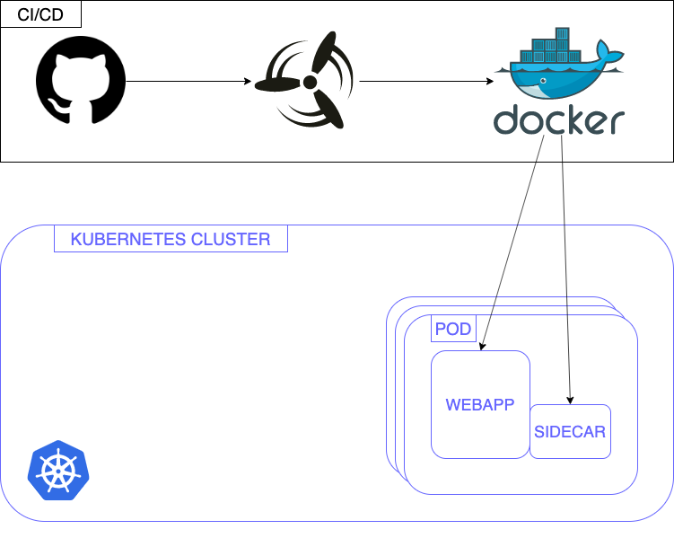

<a href="http://vmware.com"></a>

# Product Demo

This repository includes the source code for my VMware demo application. It should showcase the modern application capabilites of VMWare products. The webapp and the CI/CD pipeline can be shown seperatly or connected together.

---

### Table of Contents

- [Product Demo](#product-demo)
    - [Table of Contents](#table-of-contents)
    - [Architecture Overview](#architecture-overview)
  - [Webapp on Kubernetes](#webapp-on-kubernetes)
    - [Requirements](#requirements)
    - [Setup](#setup)
    - [Usage](#usage)
  - [CI/CD](#cicd)
    - [Requirements](#requirements-1)
    - [Setup](#setup-1)
    - [Usage](#usage-1)
  - [How to connect the webapp and the CI/CD Pipeline](#how-to-connect-the-webapp-and-the-cicd-pipeline)
  - [Project Structure](#project-structure)
  - [Detailed Explanations](#detailed-explanations)
    - [Webapp](#webapp)
    - [CI/CD concourse](#cicd-concourse)
  - [Contact](#contact)
  - [License](#license)

---

### Architecture Overview



---

## Webapp on Kubernetes

Follow these instruction to run the webapp on a Kuberenetes cluster.

### Requirements

- Access to a Kubernetes cluster
  - <a href="https://kubernetes.io/docs/tasks/tools/install-minikube/">Minikube</a>
  - <a href="https://cloud.vmware.com/vmware-enterprise-pks">PKS</a>
  - <a href="https://cloud.google.com/kubernetes-engine">GKE</a>
  - <a href="https://azure.microsoft.com/en-us/services/kubernetes-service/">AKS</a>
  - <a href="https://aws.amazon.com/eks/">EKS</a>
- <a href="https://ipinfo.io">InfoIp Access Key</a> (Optional)

### Setup

To extract public IP information from the pod you need an IpInfo key. To set this up you run following instruction with your api key.

```
$ kubectl create secret generic ipinfo-key --from-literal=ipinfo_accesskey=yourapikey
```

If you don't want to do this just run this command.

```
$ kubectl create secret generic ipinfo-key --from-literal=ipinfo_accesskey=#
```

### Usage

On your kubernetes cluster run the following kubectl command. This will deploy the webaplication on your cluster.

```
$ kubectl apply -f https://raw.githubusercontent.com/tthebst/demoapp/master/kubernetes/webapp-deploy.yml
```

To access your the created Kubernetes deployment you need to add an external loadbalancer. This differs between each of the cloud providers. Please refer to there documentation on how to expose a deployment.

If you are running on mnikube you can run the these commands to access your local cluster. A new browser should open after running after the last command if not follow the instructions on the screen.

```
$ kubectl expose deployment webapp-demo --type=LoadBalancer --port=8088
$ minikube service webapp-demo
```

You may need to wait a some time until your deployment is ready, because it need to pull the images from the repository.

---

## CI/CD

Follow these instructions to run a CI/CD pipeline with <a href="https://concourse-ci.org/">concourse</a>. This pipeline will run tests on the webapp and build the webapplication container and afterwards push the container to your repository.

### Requirements

- Container Repository preferably <a href="https://hub.docker.com/">Docker Hub</a>
- <a href="https://docs.docker.com/install/
  ">Docker Installation</a>

### Setup

To run concourse you can either follow their install <a href="https://concourse-ci.org/install.html">instructions</a> or run the following commands.

```
$ git clone https://github.com/concourse/concourse-docker.git
$ cd concourse-docker
$ ./keys/generate
$ docker-compose up -d
```

Now you have working concourse setup, which you can access at <a href="http://localhost:8080">http://localhost:8080</a>. The login ist <b>test:test</b>.

To use concourse you need to have the fly CLI. You should follow the offical concourse instrucitons which show up on <a href="http://localhost:8080">http://localhost:8080</a>. Following instruction can be used to add the downloaded fly binary to your binary folder.

```
$ mv ~/Downloads/fly /usr/local/bin
$ chmod 755 /usr/local/bin/fly
```

To test if it is working run.

```
$ fly -h
```

If you use a MAC and you get a popup message with "fly cannot be opened because developer cannot be verified" close the popup and go to Settings->Security & Privacy -> General -> on the bottom click "allow Anyway" and retry to run the command above and click open.

Now you have to setup concourse such that you can use the CI/CD pipeline. You clone this repository and login your fly CLI. Follow the instruction on the screen.

```
$ cd .. //if you are still in concourse-docker directory
$ git clone https://github.com/tthebst/demoapp.git
$ cd demoapp/concourse
$ fly --target demoapp login --team-name main --concourse-url http://localhost:8080
```

Now we have to do configure your docker credentials in <b>vars.yml</b>, such that the image can be pushed if the tests succeeded. The git-repo variable should only be changed if you have a fork of this repository, to which you can point!!!

### Usage

With the docker variables configured we are now ready to run the pipeline.

```
$ fly -t demoapp set-pipeline --pipeline demo-pipeline --config pipeline.yml -l vars.yml
```

You should now follow the instructions on the screen and unpause the pipeline in the web ui. If you click on the pipeline you can see the pipeline and how it runs. After the pipeline is run you should see the pushed images in the <a href="https://hub.docker.com/">Docker container repository</a>.

If you provided a fork of this repo in the <b>vars.yml</b> file you can now change something in the repo and push your changes. This will automatically trigger a new pipeline exection and the updated images will be pushed to the Docker repository.

---

## How to connect the webapp and the CI/CD Pipeline

The connecting piece between the webapp and the CI/CD pipeline is the container repository. The kubernetes deployment is configuered to restart the webapp pods every 45 seconds and pull in any changes from the docker repository. So your commited changes will be deployed within minutes after your last git push.

If you want to connect the webapp the container repository link in the kubernetes deployment has to match the provided docker repository link in the CI/CD pipeline. To connect you just have to change the container repository source in the kubernetes file on line 24 and 29.

---

## Project Structure

```
.
├── README.md
├── concourse
│   ├── pipeline.yml                          # concourse pipeline configuration
│   ├── tasks
│   │   ├── flask-test-podinfo-sidecat.yml    # task describtion to test podinfo sidecar
│   │   └── flask-test-webapp.yml             # task describtion to test webapp
│   └── vars.yml                              # variable file for concourse
├── flask_podinfo_sidecar
│   ├── Dockerfile
│   ├── app.py                                # main flask app
│   ├── requirements.txt
│   └── tests                                 # tests for podinfo sidecar
│       ├── __init__.py
│       └── test_api.py
├── flask_webapp
│   ├── Dockerfile
│   ├── app.py                                # main flask app
│   ├── requirements.txt
│   ├── static                                # static content of webpage
│   │   └── images
│   │       ├── k8s.svg
│   │       └── styles
│   │           └── style.css
│   ├── templates                             # html templates
│   │   ├── about.html
│   │   ├── base.html
│   │   ├── demo.html
│   │   ├── headers.html
│   │   ├── home.html
│   │   ├── map.html
│   │   └── podinfo.html
│   └── tests                                 # test for webapplication
│       ├── __init__.py
│       └── test_access.py
└── kubernetes
    └── webapp-deploy.yml                     # kubernetes deployment for webapp
```

---

## Detailed Explanations

### Webapp

The webapp consists of two parts. First there is the main web application thats serves the the webpage and includes all the logic. Second there is a so called sidecar application, which gets deployed alongside the main application in a Kubernetes Pod. The sidecar is a small api server which is only available inside the pod and provides details about the current Pod. This is the Information, which you see on the right hand side of the webpage.

### CI/CD concourse

This is the integration pipeline of this application. The first step in pipeline is to run some test on both the webapp and the pod information sidecar. The pipeline configuration first defines ressources like the git-repo and the docker repositories and afterwards a sequence of jobs to run. The first job is running the tests. This will pull a current python container and checkout this repo into the containers. Afterwards it will install all dependencies and run the tests. These steps are done for both the webapp and the podinfo sidecar. If the tests succeeded it will build both containers and push them to the container repository. The containers are now available and one can perform a update of the kubernetes deployment.

---

## Contact

Reach out to me at one of the following places!

- Mail at <a href="mailto:tgretler@vmware.com">`tgretler@vmware.com`</a>

---

## License

TBA
